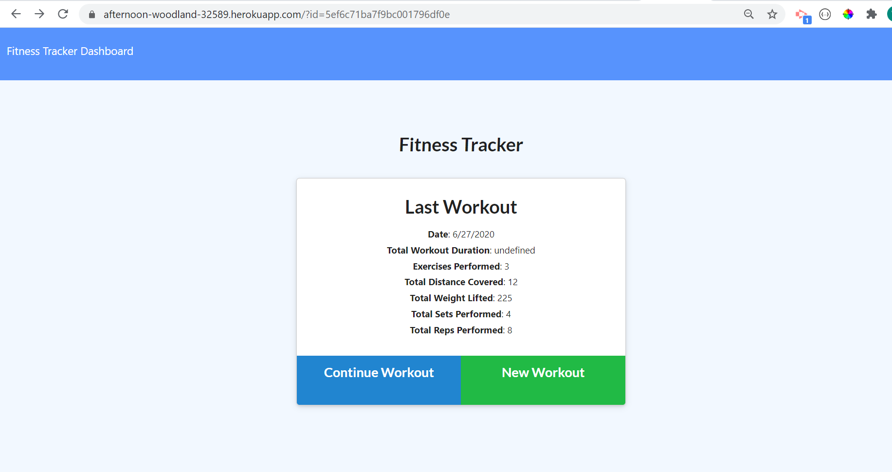
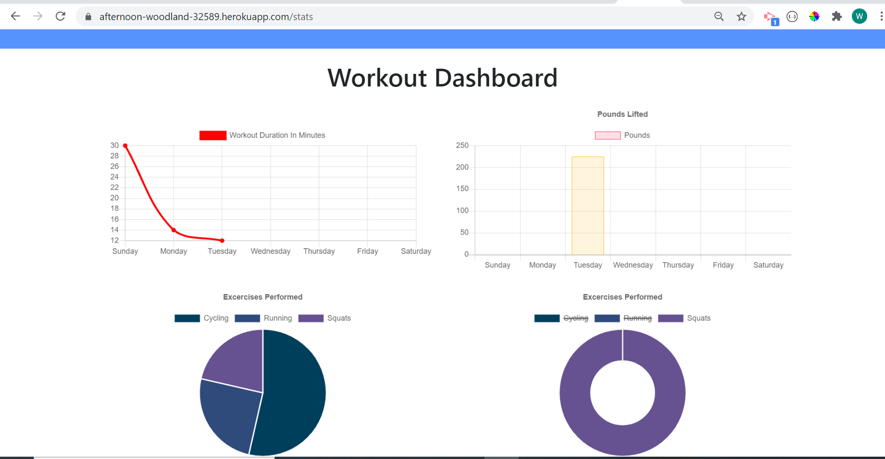

# workout-tracker

## Table of Contents
<!--ts-->
   * [Project Description](#project-description)
   * [Technologies Used](#technologies-used) 
   * [Dependencies](#dependencies)
   * [Tests](#tests)
   * [Using Repo](#using-repo)
   * [Contributing to the repo](#contributing-to-the-repo)
   * [Licenses](#licenses)
   * [Inquiries](#inquiries)
   * [Developer Info](#developer-info)
<!--te-->
## Project Description
A fitness tracker application created with Mongo database with a Mongoose schema and handles routes with Express. A user can create and track daily workouts with specific exercises, including type, weight, sets, reps and duration.

Project url: 
(https://github.com/wayele/workout-tracker)

## Screenshots
Last Workout page 
Stats page 

## Technologies Used
Node JS, JavaScript, MongoDB, Mongoose, Express, HTML, CSS

## Dependencies
npm install
## Tests
NA
## Using Repo
install all dependencies and run Mongo
## Contributing to the repo
contributions to enhance application are welcomed
## Licenses

MIT
## Inquiries
Yes

ayele.wub@gmail.com
## Developer Info:

Github username: wayele

Email: ayele.wub@gmail.com
